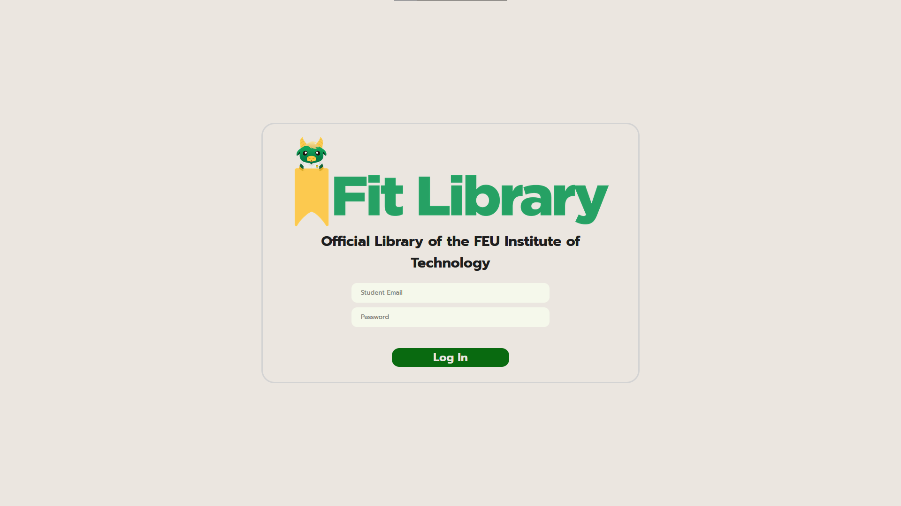
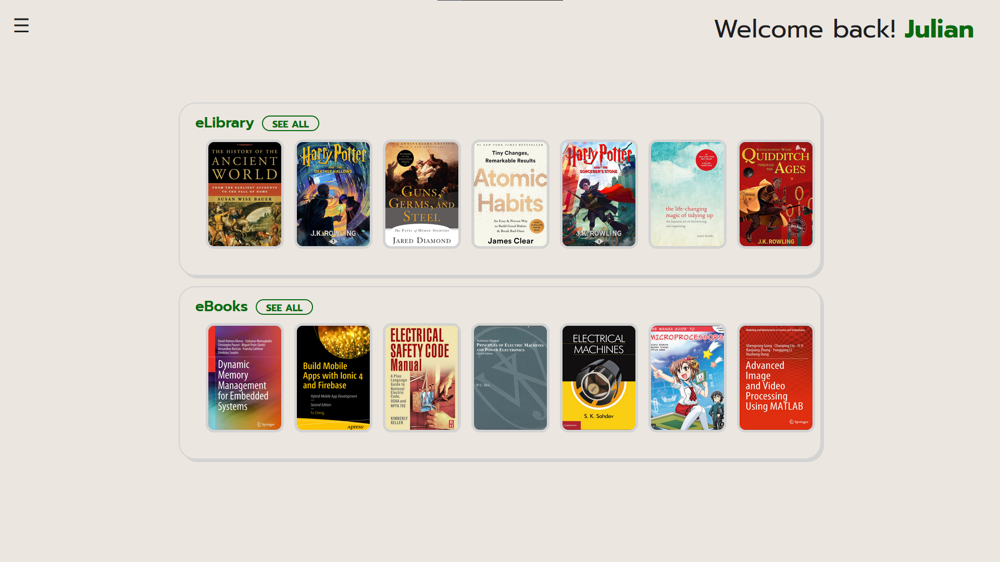
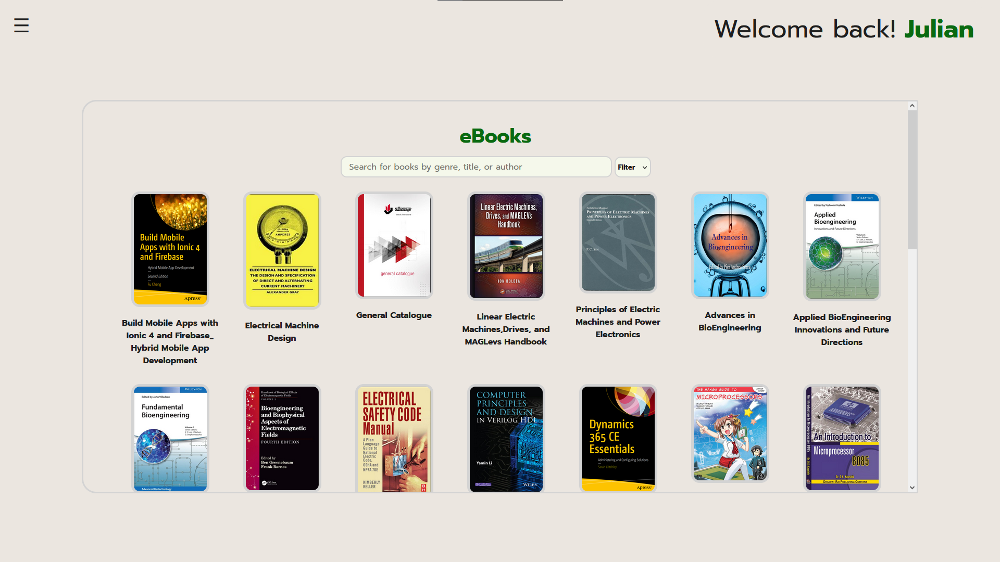
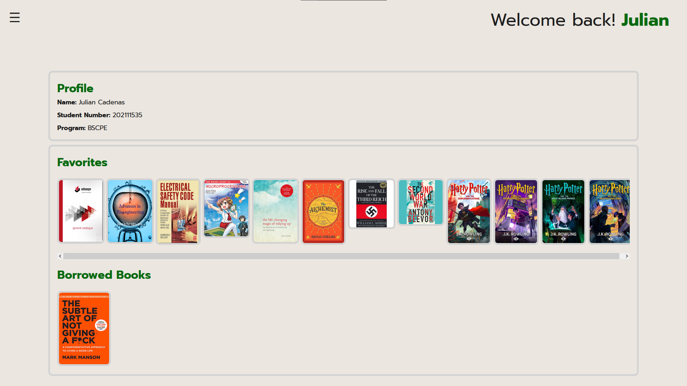
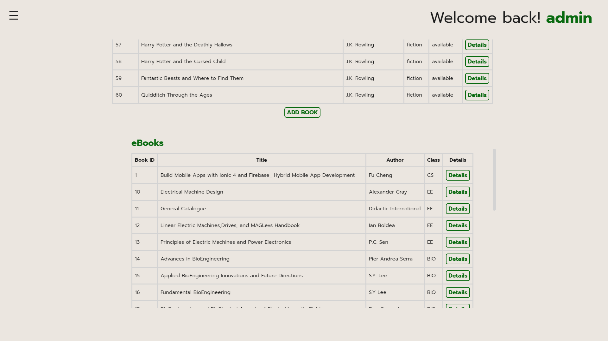

# FEU Tech Online Library

A website made using React.js and Firebase for as a final requirement in our Software Design course. 
This platform is designed to allow students to reserve or borrow books in advance before going to the library, and also to access books provided by FEU Tech in one centralized web application.

In the project directory, to start, run:

### `npm install`
### `npm start`

Runs the app in the development mode.
Open [http://localhost:3000](http://localhost:3000) to view it in your browser.

The page will reload when you make changes.
You may also see any lint errors in the console.

### `npm run build`

Builds the app for production to the `build` folder.\
It correctly bundles React in production mode and optimizes the build for the best performance.

The build is minified and the filenames include the hashes.\
Your app is ready to be deployed!

## Accounts for the public:
1. **username:** public1@try.com 
   **pw:**       password
2. **username:** public2@try.com 
    **pw:**      password
3. **username:** public3@try.com 
    **pw:**      password

## Contributors:
- Julian Cadenas
- Joshua Cormier
- Daryl Guerzon
- Christian Javier
- Bonifacio Vitasa

## Website Screenshots

### Login Page

### Dashboard

### Library Proper Page

### User Profile

### Admin Page
